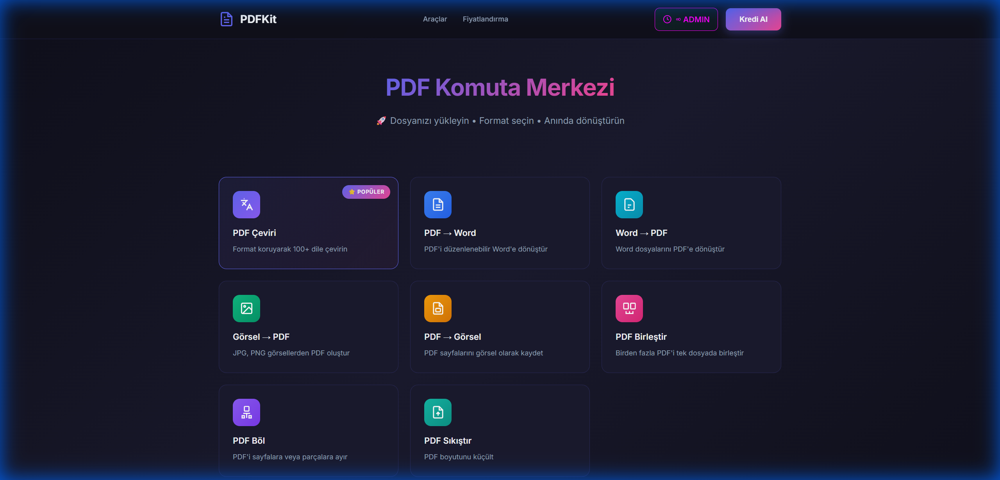

# PDF Komuta Merkezi / PDF Command Center

<div align="center">



[](https://python.org)
[](https://flask.palletsprojects.com)
[](LICENSE)

**🇹🇷 Türkçe** | [🇬🇧 English](#english)

</div>

---

## 🇹🇷 Türkçe

### 📋 Proje Hakkında

PDF Komuta Merkezi, profesyonel PDF işleme ve çeviri sistemidir. Türkçe karakter desteği ile PDF dosyalarınızı dönüştürebilir, çevirebilir ve düzenleyebilirsiniz.

### ✨ Özellikler

| Özellik | Açıklama |
|---------|----------|
| 🌐 **PDF Çeviri** | AI destekli çeviri (Gemini) ile 100+ dile çeviri |
| 📄 **PDF → Word** | PDF dosyalarını düzenlenebilir Word formatına dönüştür |
| 📊 **PDF → Excel** | PDF tablolarını Excel'e aktar |
| 🖼️ **PDF → Görsel** | PDF sayfalarını PNG/JPG olarak kaydet |
| 📎 **Görsel → PDF** | Birden fazla görseli tek PDF'te birleştir |
| 🔗 **PDF Birleştir** | Birden fazla PDF'i tek dosyada birleştir |
| ✂️ **PDF Böl** | PDF'i sayfalara veya parçalara ayır |
| 📦 **PDF Sıkıştır** | PDF boyutunu küçült |

### 🚀 Kurulum

#### Gereksinimler
- Python 3.10+
- pip

#### Backend Kurulumu

```bash
# Repoyu klonla
git clone https://github.com/statelyx/pdfconverter.git
cd pdfconverter

# Backend bağımlılıklarını yükle
cd backend
pip install -r requirements.txt

# .env dosyası oluştur
cp ../.env.example .env
# .env dosyasını düzenle ve GEMINI_API_KEY değerini gir

# Sunucuyu başlat
python app.py
```

#### Frontend

Frontend statik HTML/CSS/JS dosyalarından oluşur. Herhangi bir HTTP sunucusu ile serve edilebilir:

```bash
# Root dizinde
python -m http.server 8080
# Tarayıcıda: http://localhost:8080
```

### ⚙️ Yapılandırma

`.env.example` dosyasını `.env` olarak kopyalayın ve aşağıdaki değişkenleri ayarlayın:

| Değişken | Açıklama | Zorunlu |
|----------|----------|---------|
| `GEMINI_API_KEY` | Google AI Studio API anahtarı | ✅ |
| `PORT` | Sunucu portu (varsayılan: 5000) | ❌ |
| `FLASK_DEBUG` | Debug modu (varsayılan: false) | ❌ |

### 📡 API Endpoint'leri

| Endpoint | Metod | Açıklama |
|----------|-------|----------|
| `/health` | GET | Sağlık kontrolü |
| `/languages` | GET | Desteklenen diller |
| `/translate` | POST | PDF çeviri (PDF çıktı) |
| `/translate-html` | POST | PDF çeviri (HTML çıktı) |
| `/pdf-to-word` | POST | PDF → Word |
| `/pdf-to-excel` | POST | PDF → Excel |
| `/pdf-to-image` | POST | PDF → Görsel |
| `/compress` | POST | PDF sıkıştırma |

### 🛠️ Teknolojiler

- **Backend:** Flask, PyMuPDF, Google Gemini AI
- **Frontend:** HTML5, CSS3, JavaScript (Vanilla)
- **PDF İşleme:** PyMuPDF, reportlab, fpdf2
- **AI Çeviri:** Google Generative AI (Gemini)

---

## 🇬🇧 English {#english}

### 📋 About

PDF Command Center is a professional PDF processing and translation system. You can convert, translate, and edit your PDF files with Turkish character support.

### ✨ Features

| Feature | Description |
|---------|-------------|
| 🌐 **PDF Translation** | AI-powered translation (Gemini) to 100+ languages |
| 📄 **PDF → Word** | Convert PDF files to editable Word format |
| 📊 **PDF → Excel** | Export PDF tables to Excel |
| 🖼️ **PDF → Image** | Save PDF pages as PNG/JPG |
| 📎 **Image → PDF** | Combine multiple images into a single PDF |
| 🔗 **Merge PDF** | Merge multiple PDFs into one file |
| ✂️ **Split PDF** | Split PDF into pages or parts |
| 📦 **Compress PDF** | Reduce PDF file size |

### 🚀 Installation

#### Requirements
- Python 3.10+
- pip

#### Backend Setup

```bash
# Clone the repository
git clone https://github.com/statelyx/pdfconverter.git
cd pdfconverter

# Install backend dependencies
cd backend
pip install -r requirements.txt

# Create .env file
cp ../.env.example .env
# Edit .env file and add your GEMINI_API_KEY

# Start the server
python app.py
```

#### Frontend

The frontend consists of static HTML/CSS/JS files. It can be served with any HTTP server:

```bash
# In root directory
python -m http.server 8080
# In browser: http://localhost:8080
```

### ⚙️ Configuration

Copy `.env.example` to `.env` and set the following variables:

| Variable | Description | Required |
|----------|-------------|----------|
| `GEMINI_API_KEY` | Google AI Studio API key | ✅ |
| `PORT` | Server port (default: 5000) | ❌ |
| `FLASK_DEBUG` | Debug mode (default: false) | ❌ |

### 📡 API Endpoints

| Endpoint | Method | Description |
|----------|--------|-------------|
| `/health` | GET | Health check |
| `/languages` | GET | Supported languages |
| `/translate` | POST | PDF translation (PDF output) |
| `/translate-html` | POST | PDF translation (HTML output) |
| `/pdf-to-word` | POST | PDF → Word |
| `/pdf-to-excel` | POST | PDF → Excel |
| `/pdf-to-image` | POST | PDF → Image |
| `/compress` | POST | PDF compression |

### 🛠️ Technologies

- **Backend:** Flask, PyMuPDF, Google Gemini AI
- **Frontend:** HTML5, CSS3, JavaScript (Vanilla)
- **PDF Processing:** PyMuPDF, reportlab, fpdf2
- **AI Translation:** Google Generative AI (Gemini)

---

## 🚀 Deployment

### Railway (Backend)

1. Railway'de yeni proje oluşturun
2. GitHub repo'sunu bağlayın
3. Environment variables ekleyin:
   - `GEMINI_API_KEY`: API anahtarınız
4. Deploy edin

### Vercel (Frontend)

1. Vercel'de yeni proje oluşturun
2. GitHub repo'sunu bağlayın
3. Root directory: `/` olarak ayarlayın
4. Deploy edin

---

## 📝 Lisans / License

Bu proje MIT lisansı altında lisanslanmıştır.
This project is licensed under the MIT License.

---

## 👨‍💻 Geliştirici / Developer

Made with ❤️ by [statelyx](https://github.com/statelyx)
